# Application In Server


# Apa itu aplikasi?

Aplikasi adalah perangkat lunak yang yang berisi fitur fitur yang dapat digunakan untuk keperluan tertentu . Sebagai pengguna smartphone kalian pasti tidak asing dengan kata aplikasi , contoh nya di android ada aplikasi bernama Play Store ,Play store sendiri adalah aplikasi layanan distribusi digital yang dioperasikan dan dikembangkan oleh Google yang menyediakan wadah atau tempat semua jutaan aplikasi dengan berbagai fungsi tersedia di Play Store

Baca juga 
[Basic Shell and Computer Networking](https://github.com/pinoezz/DevOps/blob/main/stage1/Week-1/Day2/Basic-Shell-and-Computer-Networking.md)

# Pada sesi ini kita akan mencoba untuk membuat beberapa aplikasi sederhana berbasis NodeJs, Golang & Python.

# Node.Js​

NodeJs adalah runtime untuk lingkungan JavaScript di luar peramban web yang dibangun di atas mesin JavaScript V8.

Pertama-tama kita harus meng-install terlebih engine-nya dahulu. Untuk instalasi kalian bisa menggunakan beberapa perintah dibawah ini.

```
curl -o- https://raw.githubusercontent.com/nvm-sh/nvm/v0.38.0/install.sh | bash
```


keterangan : disini kita menggunakan nvm

nvm merupakan singkatan dari Node Version Manager. nvm adalah sebuah program yang akan membantu kita untuk menggunakan lebih dari satu versi Nodejs di dalam satu komputer.

```
exec bash
```

keterangan : Jika nvm belum terdeteksi gunakan perintah di atas ini

```
nvm install 16
```


Jika tahapan di atas sudah kalian lakukan, maka kalian sudah berhasil untuk melakukan instalasi node.js. Untuk melakukan pengecekan kalian bisa menggunakan perintah di bawah ini.

```
node -v
```

```
npm -v
```

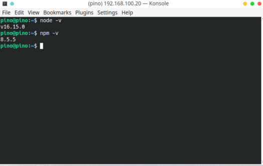

Selanjutnya kita akan menjalankan perintah npm init gunanya untuk mengisiasi project, Hasil dari kalian menjalankan perintah akan membuat file baru dengan nama package.json, package.json ini berisikan isi informasi dari aplikasi yang akan kalian buat.

```
npm init -y
```


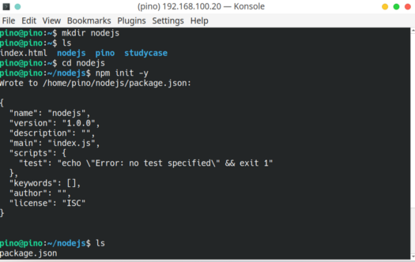

Selanjutnya kita akan menginstall Express JS. Express JS adalah framework dari NodeJS yang dirancang secara fleksibel dan sederhana untuk membantu tahap pengembangan aplikasi back end. Menginstall express js dapat dilakukan menggunakan NPM dengan perintah berikut:


```
npm install express — save
```

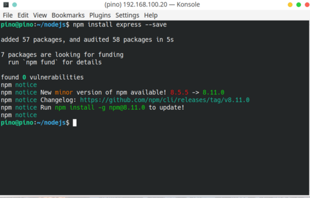

Jika sudah buat file dengan nama index.js, lalu masukan script dibawah ini

```
nano index.js
```


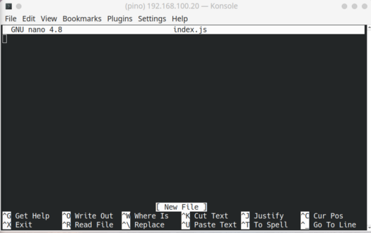

```
const express = require("express");
const app = express();
const port = 3000;

app.get("/", (req, res) => {
  res.send("Hello World!");
});

app.listen(port, () => {
  console.log(`Example app listening on port ${port}`);
});
```

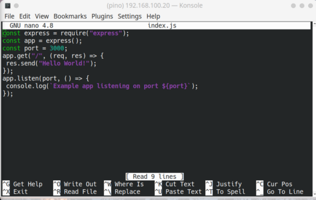

Untuk save dan keluar kalian bisa tekan Ctrl+O > enter > Ctrl + X

Jika sudah sekarang kita akan coba untuk menjalankan aplikasi sederhana yang sudah kita buat. Untuk menjalankan dapat menggunakan perintah berikut ini.

```
node index.js
```

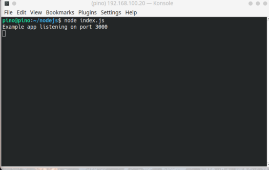

Sekarang coba akses web browser kalian setelah itu kalian coba akses dengan localhost:3000 / ip server :3000 contoh 192.168.100.20:3000

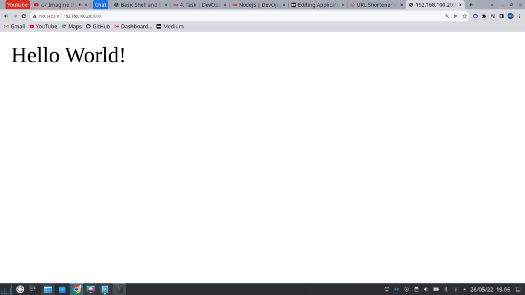

# Golang / Go​

Go adalah bahasa pemrograman yang dibuat di Google pada tahun 2009 oleh Robert Griesemer, Rob Pike, dan Ken Thompson. bahasa pemrograman sumber terbuka yang mudah, sederhana, efisien. Selain itu, Go memiliki level yang sama dengan Java.

Pertama-tama sama seperti sebelumnya, kita harus mendownload engine-nya terlebih dahulu

```
wget https://golang.org/dl/go1.16.5.linux-amd64.tar.gz && sudo su
```


```
rm -rf /usr/local/go && tar -C /usr/local -xzf go1.16.5.linux-amd64.tar.gz && exit
```


Selanjutnya masukkan path go pada .bashrc

```
sudo nano .bashrc

export PATH=$PATH:/usr/local/go/bin
```

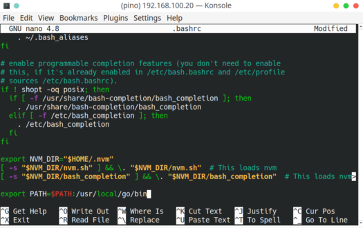

Untuk save dan keluar kalian bisa tekan Ctrl+O > enter > Ctrl + X

Jika sudah sekarang dapat verifikasi go dengan cara berikut.

```
go version
```

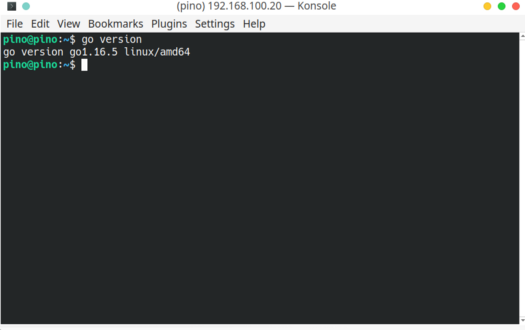

Sekarang kita akan membuat aplikasi sederhana menggunakan go. Kalian dapat menjalankan beberapa perintah berikut ini.

Buat sebuah file dengan nama index.go.

```
nano index.go
```

Masukan Script di bawah ini

```
package main

import "fmt"

func main() {
    fmt.Println("Hello World!")
}
```

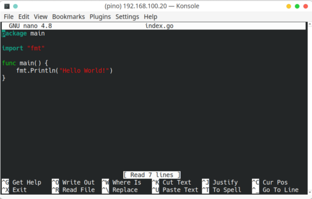

Sekarang jalankan aplikasi go dengan menggunakan perintah berikut.

```
go run index.go
```

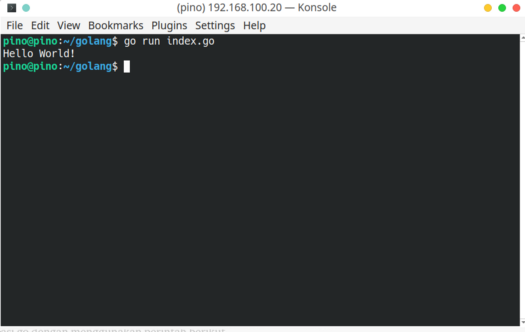

Jika aplikasi kalian ingin di build, maka jalankan perintah berikut ini.

```
go build index.go
```

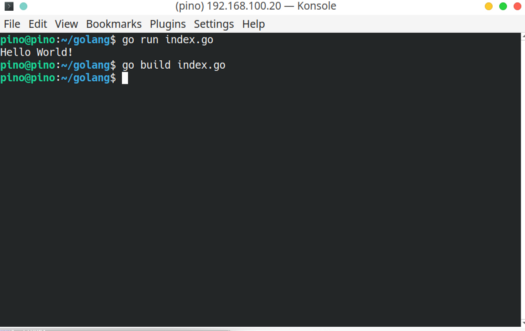

Jika sudah jalankan aplikasi dengan menggunakan perintah berikut.

```
./index
```

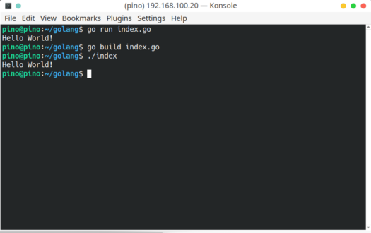

# Python

# Python3​

Python adalah Python merupakan bahasa pemrograman tingkat tinggi yang diracik oleh Guido van Rossum. Python banyak digunakan untuk membuat berbagai macam program, seperti: program CLI, Program GUI (desktop), Aplikasi Mobile, Web, IoT, Game, Program untuk Hacking.

Pertama-tama kita harus install terlebih dahulu Pyhton3. Untuk instalasi ikuti beberapa perintah di bawah ini.

```
sudo apt update; sudo apt upgrade
```

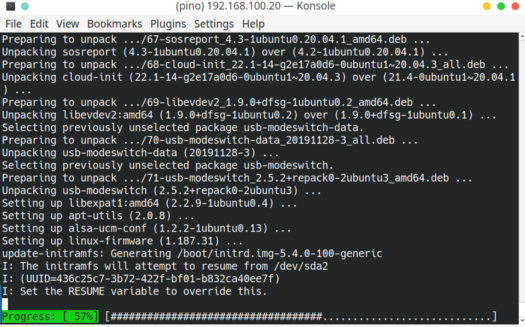

Python3 sudah ada secara default, untuk melakukan pengecekan jalankan perintah berikut.

```
python3 — version
```


Sekarang kita install package manager dari python3. Kalian dapat menggunakan perintah berikut ini.

```
sudo apt install python3-pip
```


```
pip install flask
```
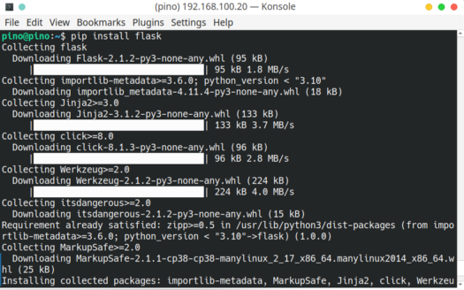

PIP adalah sebuah package management system yang biasa digunakan untuk mengatur dan menginstall package yang berisi modul-modul Python. PIP digunakan untuk menginstall Flask karena Flask ditulis dan dikembangkan dengan bahasa dan modul-modul pemrograman Python. Dengan menggunakan PIP, semua hal yang dibutuhkan untuk instalasi Flask akan diunduh dan dipasang dalam satu perintah.

Sekarang kita akan membuat aplikasi sederhana menggunakan Python3.

Kalian buat terlebih dahulu file dengan nama index.py. Lalu masukan script dibawah ini.

```
nano index.py
```

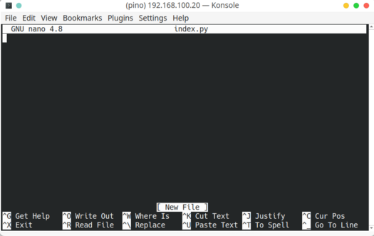

```
from flask import Flask
app = Flask(__name__)
@app.route(“/”)
def helloworld():
return “Hello World”
if __name__ == “__main__”:
app.run()
```

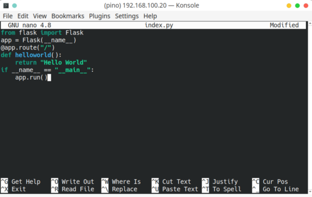

Untuk save dan keluar kalian bisa tekan Ctrl+O > enter > Ctrl + X

Jika sudah sekarang jalankan aplikasi dengan menggunakan perintah berikut ini.

```
python3 index.py
```

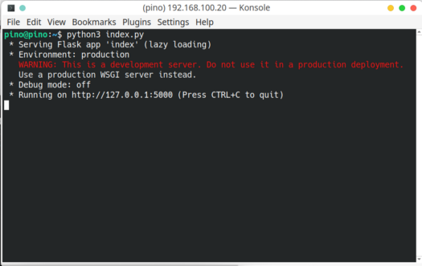

Sekarang coba akses web browser kalian setelah itu kalian coba akses dengan localhost:5000

# Konfigurasi dengan PM2 dandapat di akses melalui web browser

# Menginstal PM2 melalui NPM

Menginstal PM2 sangat sederhana, dan dapat dilakukan dalam satu baris kode.

```
npm install -g pm2
```


Untuk melihat apakah PM2 sudah terinstall atau melihat list PM2

```
pm2 list
```


Selanjutnya saya akan menjalankan aplikasi node.js menggunakan PM2

Pada pm2 kita dibutuhkan membuat ecosystem.config.js dan pakai perintah berikut.

```
pm2 ecosystem
```


Selanjutnya saya buat file node js , python dan golang


Setelah semua file di buat saya akan menjalankannya

lalu untuk memulaikan PM2 kalian ketikan

```
pm2 start node.js
```


python 
```
pm2 start python.py --interpreter python3
```


Golang

```
pm2 start golang.go
```


Untuk melihat list kalian ketikan

```
pm2 list
```


Selanjutnya saya akan tes menggunakan web browser


Dikarenakan file golang tidak dapat digunakan pada PM2 jadi untuk foto di atas dapat dibuktikan file js dan python sudah dapat di akses di publik
